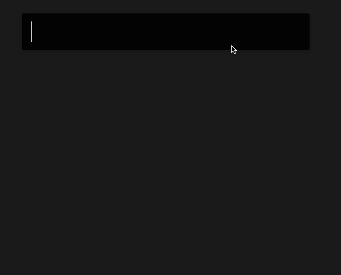
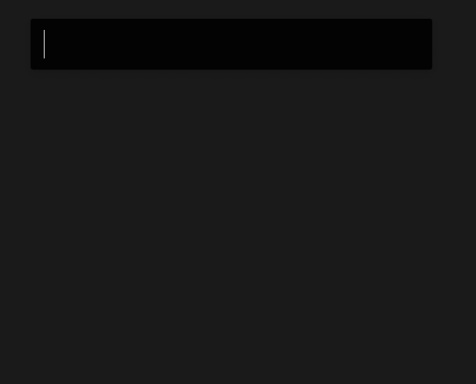
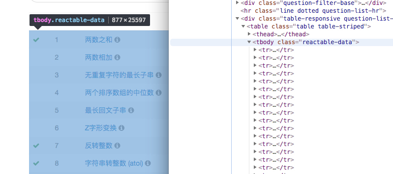

## Find LeetCode 根据题目名称查找题号，或者通过题号查找题目。确认复制网址到剪贴板。

[下载](https://github.com/qbosen/Alfred-WorkFlow/raw/master/FindLeetCode/FindLeetCode.alfredworkflow)


#### 1. 根据题号查找题目



#### 2. 根据题目名称查找题目



#### 3. 修饰键
return : 在描述页打开

cmd + return : 搜索输入内容

opt + return : 在讨论页打开

---
## PS

本来打算实时爬取的，发现难度较大，所以用取巧的方式，先把数据保存下载再进行匹配。

#### 如何更新数据？
1. 直接打开 [leetcode题库](https://leetcode-cn.com/problemset/all/) 页面，
每页数量选择全部，检阅选中至 `tbody` 部分，复制代码保存为 `html` 文件。



2. 使用 [parseHtml.py](source/parseHtml.py) 解析数据并序列化为 `dumps.txt`。
（依赖 [BeautifulSoup4](source/bs4)）
```shell
python parseHtml.py default.html
```

3. 将 `dumps.txt` 覆盖掉用户 `workflow` 下对应的文件,
