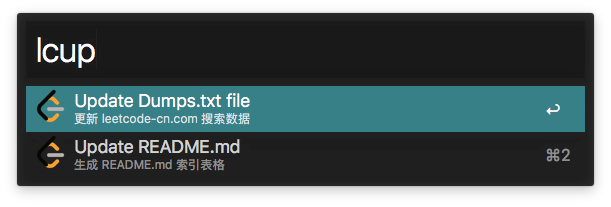

## Find LeetCode 根据题目名称查找题号，或者通过题号查找题目。在网页搜索或查看。

[下载](https://github.com/qbosen/Alfred-WorkFlow/raw/master/FindLeetCode/FindLeetCode.alfredworkflow)

#### 1. 根据题号查找题目

#### 2. 根据题目名称查找题目

#### 3. 修饰键
enter : 在描述页打开

cmd + enter : 搜索输入内容

opt + enter : 在讨论页打开

ctrl + enter : 生成文件`java`文件

#### 关于生成文件注意在环境变量中进行设置
更多使用方式参考: [LeetcodeFileGenerator](https://github.com/qbosen/leetcode_file_generator/blob/master/README-zh.md)

题目信息格式参考: [LeetcodeFileFormat](https://github.com/qbosen/leetcode_file_generator/blob/master/Formats.md)

---
#### 更新文件或者生成目录

使用 `lcup` 来更新 `dumps.txt` 文件或者生产 `README.md`

* 更新 `leetcode` 的本地资源，这个资源是用来加速本地搜索的。
* 根据 `src_path` 下的包名，生成 索引表文件

